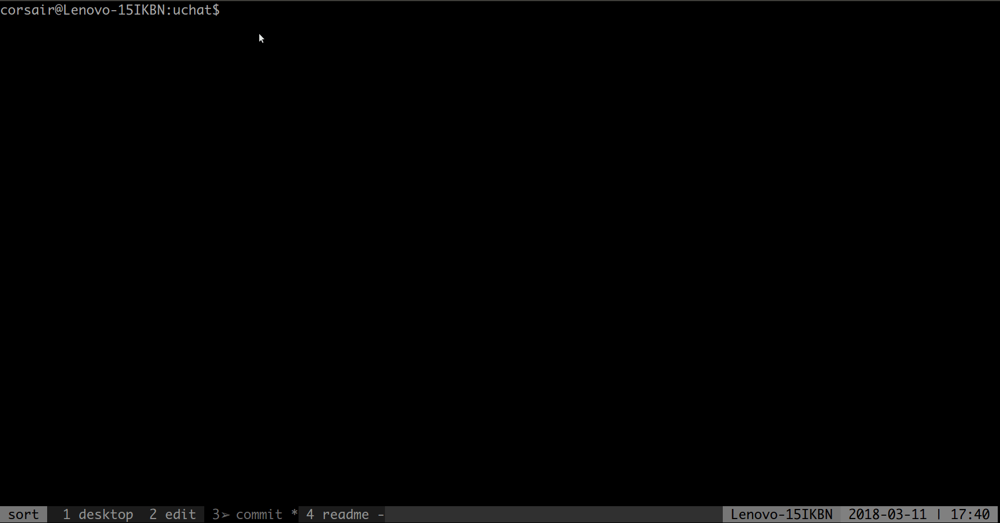

- This project aims to persist the same programming environment On Linux platform
- Done everything for me with just single command, save more time for life
    - provide different modes for installation, considering if has root privilege or not
    - put all packages from network into one directory, easy to delete
    - install all packages into one same directory, not to interfere with system old ones
    - version compare, only trigger installation of certain package when requirements met
    - auto fit for different os type, already support Ubuntu | CentOS | Mac
    - distribute packages mainly from source, so always the latest stable version
    - skip already installed packages or downloaded tar ball
    - support incremental install, safe to run consecutive times
    - pretty print, generate error log if occurs
    - robust for more possible situations and any other methods to speed up
- Catch a glimpse of the effect

- Project packaged with some awesome open source tools
    - fuzzy-find command-line tool and its vim plugin
    - the programming language code-completion engine for vim
    - the awsome terminal multiplexer running on server
    - and vim itself
- And with
    - personal dotfiles on [track-files](./track-files)
    - quick install scripts on [compile-tools](./compile-tools)
    - handy notes on [doc](./doc) which was searched quickly by rg or ag with vim
    - some self-written short commands on [tools](./tools)
    - extra bash completion on [completion](./completion)
    - favourite personal vim color scheme on [darkcoding.vim](./vim-colors/darkcoding.vim)
    - ever best programming font on [monaco.ttf](./fonts/monaco.ttf)
    - my personel [let-tmux](https://github.com/xiangp126/Let-Tmux) if needed
    - my personel [let-git](https://github.com/xiangp126/let-git) if needed
    - etc...
- Three modes deploy selection
    - home mode: without root privilege, normally install packages into $HOME/.usr
    - root mode: with root privilege, normally install packages into /usr/local
    - mixed mode

Latest released version: v4.0
## Prerequisite
- You should have full Internet access, if not refer [squid.md](./guide/squid.md) or [ssh-proxy.md](./guide/ssh-proxy.md) to establish connection
 - On Ubuntu, /bin/sh was linked to /bin/dash by default, correct it to /bin/bash
```bash
sudo ln -sf /bin/bash /bin/sh
ls -l /bin/sh
lrwxrwxrwx 1 root root 9 Mar 29 17:04 /bin/sh -> /bin/bash*
```

## Quick Start
```bash
$ sh oneKey.sh
[NAME]
    oneKey.sh -- setup my working environment with just single command

[SYNOPSIS]
    sh oneKey.sh [home | root | mixed | summary | help]

[EXAMPLE]
    sh oneKey.sh
    sh oneKey.sh root
    sh oneKey.sh summary

[DESCRIPTION]
    help -- print the help messages
    home -- install packages into ~/.usr/
    root -- install packages into /usr/local/
    mixed -- install packages into ~/.usr/ but with sudo privilege
    summary -- show installation summary

[TROUBLESHOOTING]
    sudo ln -s /bin/bash /bin/sh, ensuring /bin/sh linked to /bin/bash.
    ll /bin/sh lrwxrwxrwx 1 root root 9 Dec  7 01:00 /bin/sh -> /bin/bash*
                     _     _   _
 _ __   ___ _ __ ___(_)___| |_| |_   __
| '_ \ / _ \ '__/ __| / __| __| \ \ / /
| |_) |  __/ |  \__ \ \__ \ |_| |\ V /
| .__/ \___|_|  |___/_|___/\__|_| \_/
|_|

```
```bash
$ sh oneKey.sh [home | root]
```

## Modification Note
V3.9
* add sshfs support for root mode
* add support for install summary, more easy to update certain package
* revise makeLink.sh, skip already linked tool
* fix bug install cmake: check install status, then soft link it if failed
* in practice, ag was better than rg on Vim search, so keep install ag
* auto detect OS platform | skipping already installed packages
* correct key parameter of config file adjusting to current system
* add support for MAC system
* .ycm_extra_conf.py adjust c++ include dir/version
* .vimrc adjust python3 interpreter path
* use downloads/ to store all packages wget/clone
* safe to run installation routine many times
* compile newly gcc/c++ version if not support c++ 11
* add number of cpu core check, make -j [cores]
* add YouCompleteMe
* use oneKey.sh replace of some small scripts

V3.1
* use tmux plugin manager for Tmux plugins.
* add tmux-resurrect and update install.sh
* update .tmux.conf and files associated
* reformat function call for some 'case' switch.
* add regret mode for autoHandle script.

V2.1
* for 'backup' mode, add mechanism to check if file to be backuped exists.
* add alias for 'grep'
* change name autoUpdate.sh => autoHandle.sh
* add dry mode and re-format code logic.
* use cat << instead of many echo for this script.

V1.0
* user-friendly manipulate for backup | restore | confirm | clean .

## Tips of key Script

autoHandle.sh and makeLink.sh was automatically called by oneKey.sh,

however their function can be used outside this project, so separate them alone

- Tips of autoHandle.sh

comment on/off one of them to add/remove from tracking

```bash
trackFiles=(
    ".vimrc"
    ".tmux.conf"
    ".gitconfig"
    ".gitignore"
    ".bashrc"
    ".ycm_extra_conf.py"
)
```

```bash
$ sh autoHandle.sh
[NAME]
    $execName -- auto backup/restore key files of current linux env.

[SYNOPSIS]
    sh $execName [restore | backup | track | auto | regret | clean]

[EXAMPLE]
    sh $execName backup
    sh $execName track
    sh $execName restore
    sh $execName auto

[TROUBLESHOOTING]
    if 'sh $execName' can not be excuted.
    $ ll `which sh`
    lrwxrwxrwx 1 root root 9 Dec  7 01:00 /bin/sh -> /bin/bash*
    # on some distribution, sh was linked to dash, not bash.
    # you have to excute following command mannually. -f if needed.
    $ ln -s /bin/bash /bin/sh

[DESCRIPTION]
    backup  -> backup tracked files under environment to ${backupDir}/
    track   -> deploy tracked files from 'backup-ed' to ${trackDir}/
    restore -> restore tracked files to environment from ${trackDir}/
    regret  -> regret previous 'restore' action as medicine
    auto    -> run 'backup' & 'track' as pack
    clean   -> clean ${backupDir}.*/, but reserve main backup dir
```

- Tips of makeLink.sh

```bash
[NAME]
    makeLink.sh -- make link from ~/myGit/giggle/tools/
                             to   ~/.usr/bin/
[USAGE]
    sh makeLink.sh [install | uninstall | help]

[EXAMPLE]
    sh makeLink.sh
    sh makeLink.sh install

[TROUBLESHOOTING]
    ~/.usr/bin/ should be placed in PATH

                 _          _ _       _
 _ __ ___   __ _| | _____  | (_)_ __ | | __
| '_ ` _ \ / _` | |/ / _ \ | | | '_ \| |/ /
| | | | | | (_| |   <  __/ | | | | | |   <
|_| |_| |_|\__,_|_|\_\___| |_|_|_| |_|_|\_\

```
```bash
sh makeLink.sh install
```

## License
The [MIT](./LICENSE.txt) License (MIT)
