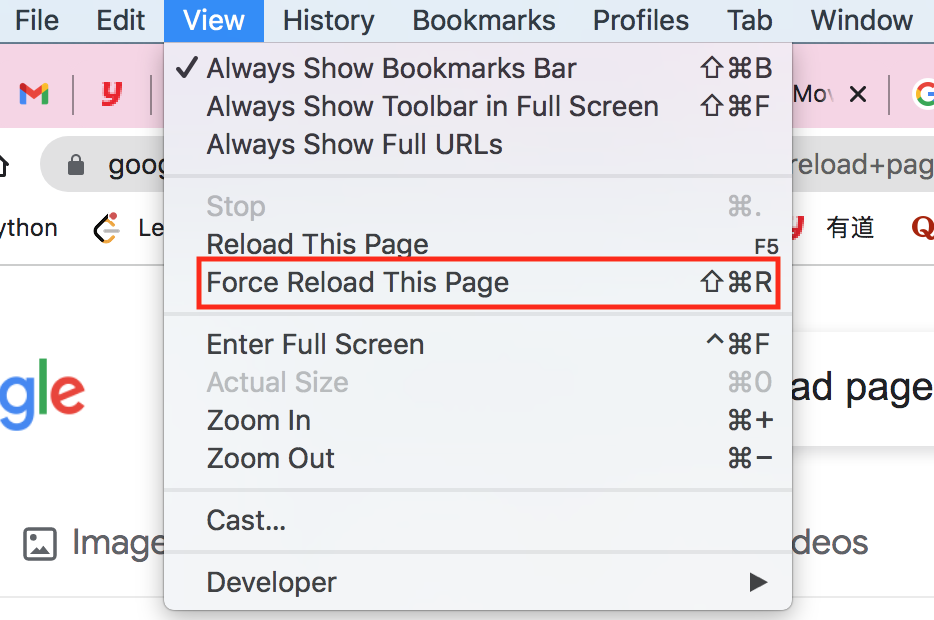

## chrome
### Developer Tools - F12
- Network

use filter: larger-than:50k to got `ts` files

**ts: MPEG-2 Transport Stream**

### Force Refresh Without Cache in Chrome

Force Refresh Without Cache in Chrome for Mac with a Keyboard Shortcut
Hold down the `SHIFT` key on the Mac Keyboard.
Click the **View** menu and choose **Force Reload**

<div align=center></div>

---
### Manual Install Chrome
#### on Ubuntu
- add key

```bash
wget -q -O - https://dl-ssl.google.com/linux/linux_signing_key.pub | sudo apt-key add -
```

- set repository

```bash
echo 'deb [arch=amd64] http://dl.google.com/linux/chrome/deb/ stable main' | sudo tee /etc/apt/sources.list.d/google-chrome.list
```

- install packages

```bash
sudo apt-get update
sudo apt-get install google-chrome-stable
```

### recommended chrome plugins
- uBlock Origin
- SwitchyOmega - a proxy configuration tool
- Absolute Enable Right Click & Copy(Firefox)
- ~~stylish(Deprecated now)~~
  - ~~Global dark style - changes everything to DARK~~
  - ~~Midnight Surfing - Global Dark Style~~