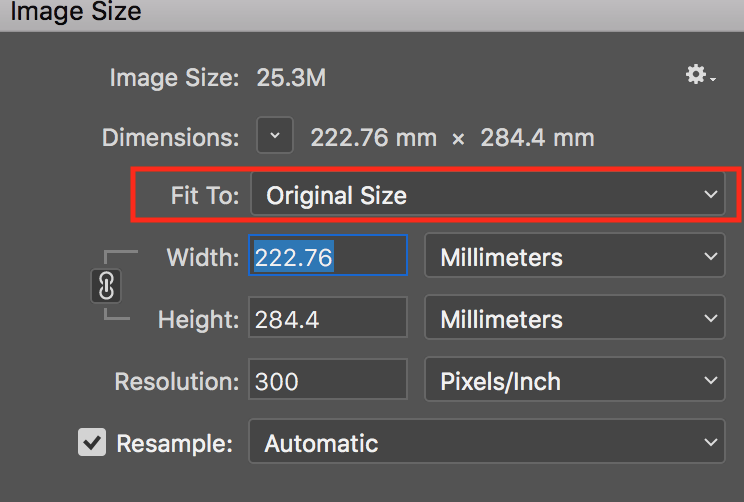
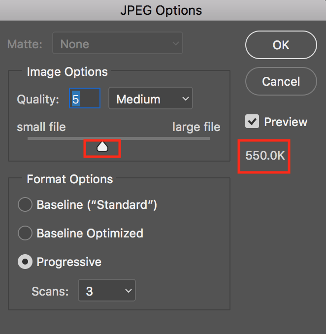

## Photoshop

**Note: Dimension and Size are different terms for an image**

- Dimension: like A4 size, A5 size, 452X245, etc.
- Size: 4M, 452KB, etc.

### How to re-dimension an image to A4 size

##### Adjust the dimension
- Open the image
- Goto `Image->Image Size` or use shortcut key `Alt + Cmd + I`

- Goto `Fit to`, choose `A4` size.

##### Save the re-dimensioned image

- Goto `Save As`, choose `JPEG`. **!!Do not use Export function!!**

### How to Compress an image | Reduce the size
- Open the image
- Goto `File->Save As`
- Compress the image by draging the slider, you can see the final size of the file in **real time**.

