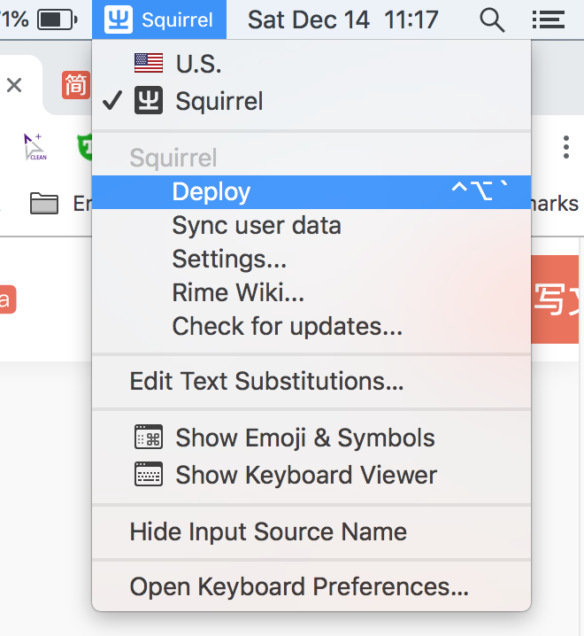

## Squirrel-Input Method

### Remove SougouInput from you system Completely
use its official install/uninstall routine first, then

```bash
rm -rf /Library/Input\ Methods/SogouInput.app
rm -rf /Users/user/Library/Caches/SogouServices
rm -rf /Users/user/.sogouinput
```

### Install Squirrel Input Method
#### On Mac

```bash
brew cask install squirrel
```

#### On Linux

- [鼠须管官网](http://rime.im/)
- [各Linux 發行版安裝說明，或從源碼編譯安裝](https://github.com/rime/home/wiki/RimeWithIBus)
- [Official Github](https://github.com/rime/squirrel)
- [鼠须管简单配置](https://www.dreamxu.com/install-config-squirrel/)

#### On Windows

- [鼠须管官网下载页面](https://rime.im/download/)

### Deploy Squirrel

[鼠须管输入法 傻瓜版配置 - 基于 rime_pro 增强包](https://segmentfault.com/a/1190000005754706)

- backup config first

```bash
cp -a ~/Library/Rime ~/Library/Rime_ori_$(date +%Y%m%d%H%M%S)
```

- extract rime_pro

untar rime_pro and copy all the file to ~/Library/Rime

```bash
tar -zxvf template/rime_pro.tgz -C ~/Library/Rime --strip-components 1
```

### Key Notice
按組合鍵 Ctrl+` 或 F4 鍵喚出輸入方案選單，由此調整 Rime 輸入法最常用的選項。

You Could use `Gboard` on iphone

### Minor Modification
- 修改候选词个数

```bash
cd ~/Library/Rime
vim default.custom.yaml

# default.custom.yaml
# encoding: utf-8

patch:
  switcher:
    caption: 〔方案选单〕
    hotkeys:
    - Control+grave

  # 候选词 5 个
  menu:
    page_size: 10
```

then re-deploy

<div align=center></div>