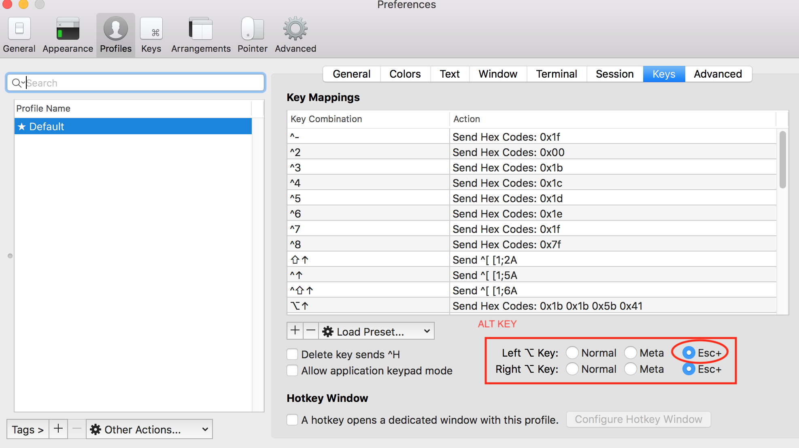

## VIM - VI Improved
### add blank line between each line
refer to [add blank line between each line](https://qastack.cn/superuser/592503/vim-adding-empty-line-between-lines)

```bash
:%s/\n\@<!\n\n\@!/\r\r/g
```

### Removing trailing whitespace
```vim
:%s/\s\+$//gc
```

### Del `^M` generated from Windows
```vim
:%s/\r//gc
```

### Shortcut Key with Iterm2
As illustrated



```bvim
# mapping Alt to Esc+
# so typing 'Alt + O' equals typing 'Esc + O'

# then

Alt + o   next line in 'Insert Mode'
Alt + Shift + i  goto current head of line
```

### copy
> Copy line 31-33 to below current line

```vim
:31, 33 copy .
```
<br>

---

### registers
<https://vi.stackexchange.com/questions/84/how-can-i-copy-text-to-the-system-clipboard-from-vim>