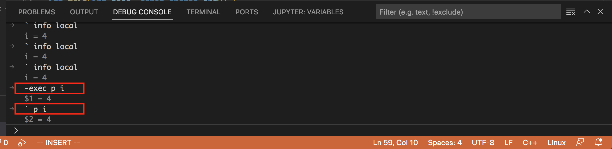

## VSCode

- [Plugins that I Recommend](#plugins)
    - [vim](#vim)
    - [Remote - SSH](#remotessh)
    - [GitLens - Git Supercharged](#gitlens)
    - [C/C++ Compile Run](#ccompilerun)
- [Useful Config and Command Tips](#configs)
    - [Get paste board when connect to remote tmux](#pastefromtmux)
    - [Open file on a new tab](#openfileonnewtab)
    - [Go back to origilal location after F12](#goback)
    - [Go to desired files or lines](#goto)
    - [Search specific function in current file](#searchfunction)
    - [Search for text (can be a function name) in all files](#searchtext)
    - [Search specific commit through commit message using GitLens](#searchcommit)
    - [Python function cannot jump to its definition](#pythonjump)
    - [C/C++ No synbols found and cannot jump | Install from VSIX](#cnosymbol)
- [How to create user snippets for language programming](#usersnippets)
- [How to execute command in Debug mode](#gdbexecmode)
- [Troubleshooting using VSCode](#troubleshooting)

<a id=plugins></a>
### Plugins that I Recommend

<a id=vim></a>
#### Vim
Vim emulation for VSCode

<a id=remotessh></a>
#### Remote - SSH

Open any folder on a remote machine using SSH and take advantage of the full features of VSCode. Think about `sshfs` on Linux.

- Template for `SSH config` | Connect to a server

```bash
# put these contents under ~/.ssh/config
# refer https://linuxize.com/post/using-the-ssh-config-file
Host remotedev
    HostName 192.168.1.10
    User Annonymous
    Port 22
    IdentityFile ~/.ssh/id_rsa_MyPrivate

Host tyrell
    HostName yrell.com.ca

Host martell
    HostName 192.168.10.50

Host *ell
    user oberyn

Host * !martell
    LogLevel INFO

Host *
    User root
    Compression yes

```

Then you could connect to the server use

```bash
ssh remotedev
# it equals to
ssh -p 22 Annoymous@192.168.1.10 -i ~/.ssh/id_rsa_MyPrivate
```

<a id=gitlens></a>
#### GitLens
GitLens - Git Supercharged | Highly recommended plugin

On Windows, use `Ctrl + Click` to _Show Commits_

<a id=ccompilerun></a>
#### C/C++ Compile Run
Compile & Run single c/c++ files easly

- Keybindings

Linux|	Windows|	Mac	| Description
:---:|:---:|:---:|:---
f6|	f6|_cmd+r_|	Compiles and runs the file
crtl+6	| ctrl+6|	cmd+6|	Compiles and runs the file
f8|	f8|	cmd+y|	Compiles and run the file in external console
f7|f7|	cmd+t|	Compiles and run the file specifying custom arguments and flags

---
<a id=configs></a>
### Useful Config and Command Tips

<a id=pastefromtmux></a>
#### Get paste board when connect to remote tmux

    on Windows, **Shift + "Mouse Choose"** can paste contents from tmux

<a id=openfileonnewtab></a>
#### Open file on a new tab

    File -> Preference -> Settings -> Workbench ->Editor Management ->Enable Preview

*uncheck `Enable Preview`, then a new opened file will appear in on a new tab*

<a id=goback></a>
#### Go back to origilal location after search function's definition (F12)
    Go -> Back
Shortcut Key: `Alt + LeftArrow`

<a id=goto></a>
#### Go to desired files or lines
- Go to desired files

`Ctrl + P` followed by desired file name.

- Go to desired lines

```bash
# Original the shortcut key is `Ctrl + G`
# due to conflict, change it to `Ctrl + '`
    File -> Preferences -> Keyboard Shortcuts
    Type "go to line" in the search bar
    and then edit the Keybinding column
```

<a id=searchfunction></a>
#### Search specific function in current file
    Ctr + P, followed by symbol @

Then Type your desired function name. For Example:

    Ctrl + P, then @write_data

<a id=searchtext></a>
#### Search for text (can be a function name) in all files in a directory | show in sidebar

You can do `Edit`->`Find in Files` (or `Ctrl+Shift+F` - default key binding, `Cmd+Shift+F` on MacOS) to search the Currently open Folder.

<a id=searchcommit></a>
#### Search specific commit through commit message using GitLens

`CMD + Shift + P` for Mac, `Ctrl + Shift + P` for Windows

<div align=left></div>

then type `search commits` followed by Searching Commit Messages or Author Info

<div align=left></div>

<a id=pythonjump></a>
#### Python function cannot jump to its definition
~~Install Pylance in vscode extension market, then change `python language server` in the settings from Default to Microsoft~~

root cause is you did not set `Python Search Path` well. When you open terminal->problems, there're so many errors associated with unresolved and undefined.

Open `Settings`, type **env** you can find one field named `Python: Env File`, the default value is `${workspaceFolder}/.env`

so goto your workspaceFolder and create the file .env (if not exist)

add one line into .env. Say, you want to add absolute `/xx/isilon/test-qa/lib`

    PYTHONPATH=/xx/isilon/test-qa/lib

or something like this if PYTHONPATH already exist, separated each PATH by colon:

    PYTHONPATH=${PYTHONPATH}:/xx/isilon/test-qa/lib

you should also need to check `env` command

```bash
env | grep -i python
```

**Template for .env**

```bash
# Template for .env

PYTHONPATH=${PYTHONPATH}:/root/myGit/onefs/isilon/test-qa/lib
PYTHONPATH=${PYTHONPATH}:/root/myGit/onefs/isilon/test-qa/migration/lib
PYTHONPATH=${PYTHONPATH}:/root/myGit/onefs/isilon/test/pylib
PYTHONPATH=${PYTHONPATH}:/root/myGit/onefs/isilon/test/syncIQ/
PYTHONPATH=${PYTHONPATH}:/root/myGit/onefs/isilon/lib/python/
PYTHONPATH=${PYTHONPATH}:/root/myGit/onefs/build/nose
```

**Another Template for .env, including alias for outer folder**

```bash
# including alias for isi
# isi=> isilon/lib.python
# cd ~
# mkdir -p .isilon/lib
# cd .isilon/lib
# ln -s isi <pre-path>/isilon/lib/python
```

Then add this line into the bottom of the previous standard .env template

```
PYTHONPATH=${PYTHONPATH}:/root/.isilon/lib
```

<a id=cnosymbol></a>
#### C/C++ No synbols found and cannot jump | Install from VSIX
must because the c/c++ tool was not successfully installed and enabled.

check your estensions library and find C/C++ ms-vscode.cpptools, basically in the OUTPUT page of the terminal tool

there must be some errors, but there're high chances that you will not see them.

So, to ensure you install the cpptools well, try to install them manually.

Go to the official page: https://github.com/microsoft/vscode-cpptools/releases

and download the latest cpptools-linux.vsix packages. Refer to https://stackoverflow.com/questions/37071388/how-can-i-install-visual-studio-code-extensions-offline

Then open VS-Code switch to Extensions sidebar, click on the sllipsis in the right upper corner, choose _Install from VSIX_, browser the packages your recentlly downloaded.

<a id=usersnippets></a>
### How to create user snippets for language programming
```
Code > Preferences -> Configure User Snppets
```

Then select specific language.

Here is the link for [vscode-defined Python snippets](https://github.com/microsoft/vscode-python/blob/2020.12.424452561/snippets/python.json) that can be pasted as user snippets.

<a id=gdbexecmode></a>
### How to execute command in Debug mode
refer to <https://github.com/microsoft/vscode-cpptools/issues/7400> &
<https://github.com/microsoft/MIEngine/pull/976>

- launch debugging
- in Debug Console, type `-exec` or ` as the prefix of your command

```bash
# print the value of i
p i
```
<div align=left></div>

<a id=troubleshooting></a>
### Troubleshooting using VSCode
- Bug Description

```bash
Missing or invalid credentials.
Error: connect ECONNREFUSED /var/folders/tx/53fffl0j51qb47mhnlf8zsdc0000gn/T/vscode-git-1d38026c7f.sock
at PipeConnectWrap.afterConnect [as oncomplete] net.js:1056:14) {
      errno: 'ECONNREFUSED',
                   code: 'ECONNREFUSED',
                     syscall: 'connect',
                       address: '/var/folders/tx/53fffl0j51qb47mhnlf8zsdc0000gn/T/vscode-git-1d38026c7f.sock'

}
Missing or invalid credentials.
Error: connect ECONNREFUSED /var/folders/tx/53fffl0j51qb47mhnlf8zsdc0000gn/T/vscode-git-1d38026c7f.sock
at PipeConnectWrap.afterConnect [as oncomplete] net.js:1056:14) {
      errno: 'ECONNREFUSED',
                   code: 'ECONNREFUSED',
                     syscall: 'connect',
                       address: '/var/folders/tx/53fffl0j51qb47mhnlf8zsdc0000gn/T/vscode-git-1d38026c7f.sock'

}
remote: No anonymous write access.
fatal: Authentication failed for 'https://github.com/username/repo.git/'
```

- Resolve Solution
Close current Terminal and create a new one in VsCode. If you also use Tmux in the terminal,
kill current tmux session and also create a new one.

The problem will be fixed. April 2, 2021
